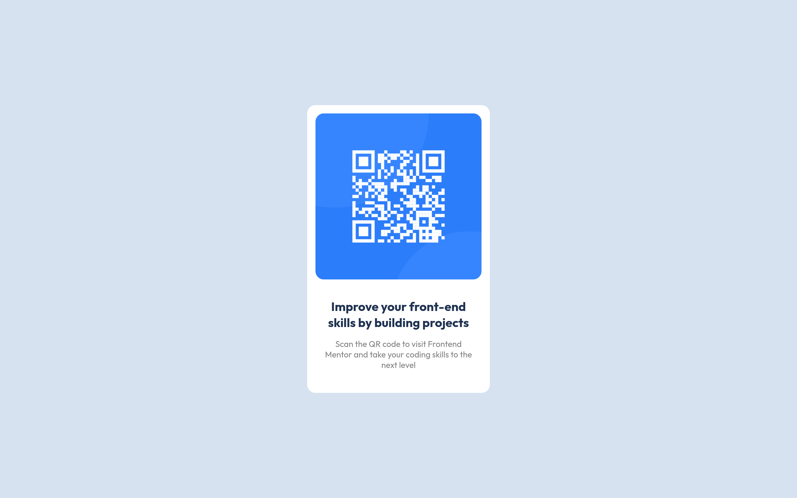

# Frontend Mentor - QR code component solution

This is a solution to the [QR code component challenge on Frontend Mentor](https://www.frontendmentor.io/challenges/qr-code-component-iux_sIO_H). Frontend Mentor challenges help you improve your coding skills by building realistic projects. 

## Table of contents

- [Overview](#overview)
  - [Screenshots](#screenshot)
    - [Desktop](#desktop)
    - [Mobile](#mobile)
  - [Links](#links)
- [My process](#my-process)
  - [Build with](#build-with)

## Overview

### Screenshots

#### Desktop

#### Mobile

### Links
- Solution URL: [Github repo](https://github.com/jkalasas/frontendmentor-qr-code)
- Live Site URL: [QR Code](https://frontendmentor-qr-code.pages.dev/)

## My Process
### Built with
- Plain HTML and CSS